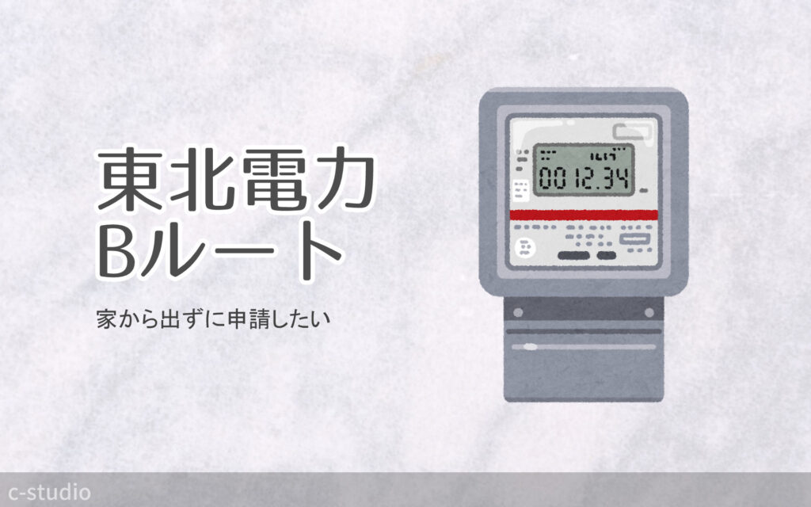
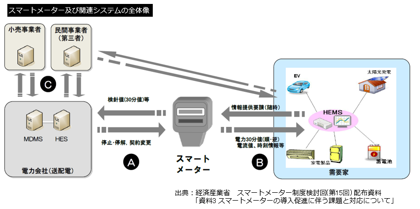
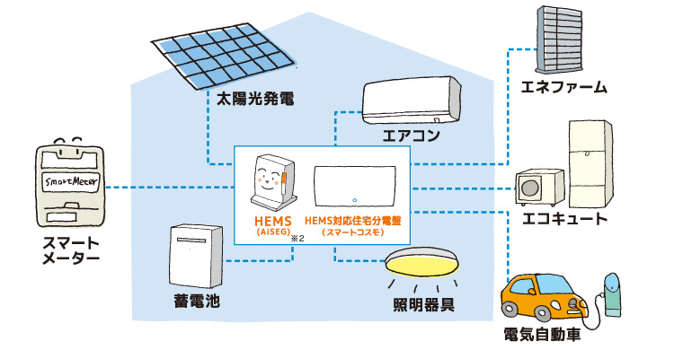
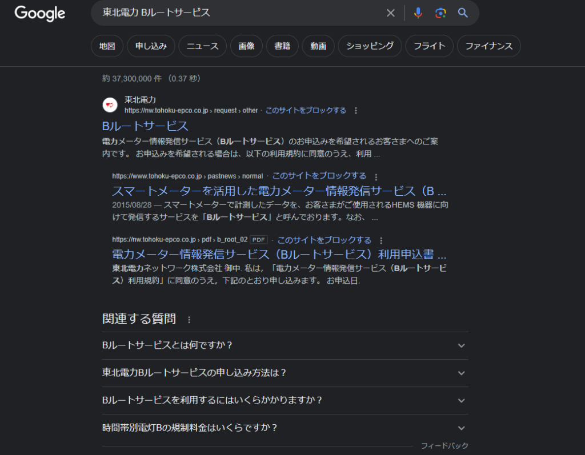
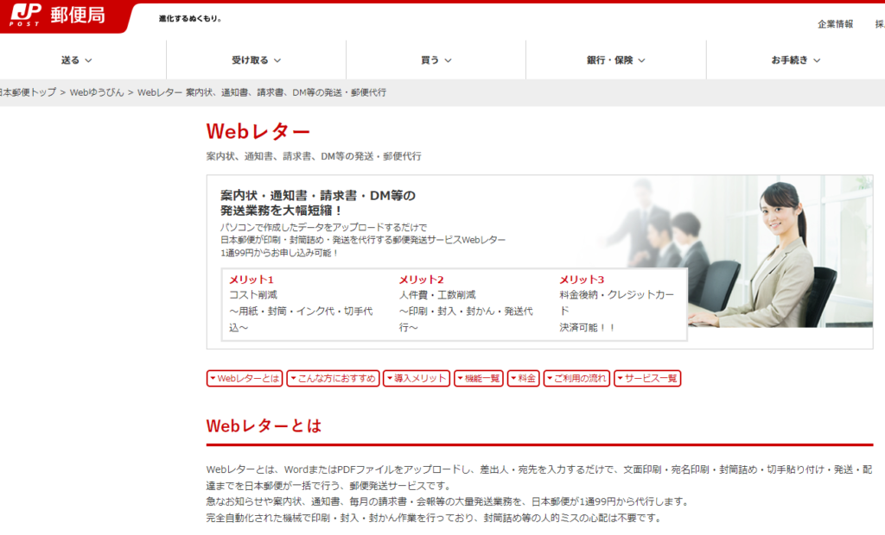

[Nature remo E lite](https://nature.global/nature-remo-e-lite/)を購入しました。

購入のいきさつや使用感については別記事でご紹介しています。

https://c-std.com/nature-remo-e-lite/

電気使用量の監視システムに欠かせないのが B ルートサービスの申請です。この記事では**B ルートとはなんぞや**、ということと、**申請方法**について解説してみます。

制度や仕組みに関して素人ですので、素人なりに調べてわかったことのまとめという感じで見ていただければ。プチ自由研究発表です。

## B ルートサービスとは？

B ルートサービスは、スマートメーターと家庭をつなぐサービス。

### スマートメーター化に伴って可能性が広がる

最近、電気メーターの仕様が「**スマートメーター**」に切り替わっているのをご存知でしょうか。

そういえば昔は検針員さんが電気メーターをチェックしていましたが、あまり見かけなくなりました。それはスマートメーターに切り替わって、遠隔で電気使用量を送信できるようになったからなんですね。電気メーター自身からの発信機能がついたというわけです。

### A、B、C ルートの存在

スマートメーターを介して、電力会社や小売業者、HEMS と言われる受信家電を持つ家庭などが情報のやりとりをします。電気周りの情報を必要各所と連携していくんですね。

どことどこで情報をつなぐか、というのを示したのが「ルート」。**やりとりする間ごとに A、B、C ルートと名前がつけられています。**

### 家庭とつながる B ルート

まさしく**スマートメーターと家庭をつなぐのが B ルート**というわけです。

<figure>

<figcaption>

出典:Panasonic [スマート HEMS : HEMS（ヘムス）とは？](https://www2.panasonic.biz/jp/densetsu/aiseg/hems/about/)

</figcaption>

</figure>

HEMS(Home Energy Management System（ホーム エネルギー マネジメント システム))と言われる機器とスマートメーターを B ルートを利用し連携します。HEMS は電気使用量の監視、家電の制御などができるらしいです。

上図を見るとエアコンや照明、太陽光や蓄電池など家庭の電力の肝になる部分の管理ができそうでわくわくします。Nature remo E lite は全体電気使用量の監視のみですが、HEMS 関連は調べていくとまた深そうです。

## B ルートサービスを申込む（東北電力の場合）

申請書を事業所へ郵送する。

では B ルートを使えるようにしてもらいましょう。

B ルートサービスの申込は、契約している電力会社申請します。わが家は東北電力と契約しているため、その流れを記録します。

### 申請方法を調べる

「東北電力　 B ルートサービス」で検索しました。

一番上に出てきた、一番それらしい「B ルートサービス」の WEB サイトを開くと[東北電力ネットワーク](https://nw.tohoku-epco.co.jp/consignment/request/other/)のページが開きました。

上記サイトに**B ルートサービスの利用規約、利用申込書**の pdf ファイルが置いてあります。一般家庭なら低圧用で OK。

申込は**利用申込書を最寄りの事業所へ郵送すればよい**、とのことです。

…ここまで書いていて違和感というか、あれ？と…  
私が申請手続きしたときは上記サイトに辿り着けませんでした。いくら検索しても、東北電力サイト内をくまなく探しても、ありませんでした。なので検索ページに転がっていた pdf だけダウンロードしてダメ元で送ってみよう、と申請したんですが…今はちゃんと案内ページがあるんですね。良かったです。

## Web レターサービスで郵送してみる

申込書を郵送すればよいのはわかったんですが、この時代になって郵送かぁ…と面倒に思ってしまったのでした。私が出不精なだけですけども。

外出せず、切手を買わずに郵送する方法はないか？と探したら、ありました。

郵便局のサービス、[Web レター](https://www.post.japanpost.jp/service/webletter/)。

pdf や word ファイルを印刷・封緘し指定の住所へ郵送してくれるサービスです。まさにこれを求めていた！基本的に大量発送や法人向けなようですが、1 通から発送や個人利用も OK のよう。ありがたくこちらを使わせていただくことにしました。ちなみに料金は白黒 1 通 99 円～。感じ方は人によりますが、私は手間を考えれば安いと感じました。

早速利用申込書を書き、pdf ファイルとして取り込んで発送します。

### pdf が認識されず word ファイルで送る

願ったり叶ったりな Web レターですが、何故か pdf だとサイズが合わない旨のエラーが出て送付できず。

何度 A4 にリサイズしようと受付られなかったため、word ファイルで保存したら問題なく処理されました。調べても同じ症状の方は見当たらなかったのでこちらの環境問題の可能性は高そうです。

無事にデータが認識され、発送元・送付先住所を指定して手続き完了です。イレギュラーな形で送付した申込書ですが、無事に受理されるでしょうか。

## B ルートサービスが使えるようになった

Web メール送付から約 10 日、東北電力ネットワークから封書が届きました。

内容は**B ルートサービスのお客様認証 ID・パスワードのお知らせ**。ちゃんと受付していただけたようです！

Nature remo E lite 含む HEMS 機器の連携に必要な ID とパスワードが発行されました。併せて情報発信開始日も記載されています。

これでようやく電気使用量の監視ができます、意外と長い道のりでした。

HEMS 機器の利用を予定している方は、早めに B ルートサービスの利用申請をしておくとスムーズだと思いますよ。

それではここまでご覧いただきありがとうございました m(\_ \_)m
