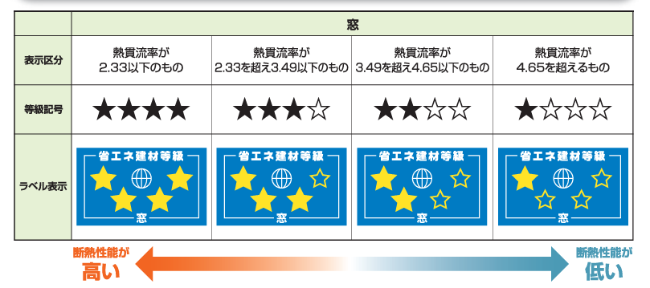

自宅をリカバリーするきっかけについて書いておこうと思います。

## わが家のステータス

- 2x4 工法（木造枠組壁工法）

- 4 地域　断熱等級 4 　 UA 値 0.65（ほんと？）当時基準 0.75 以下で最高等級の 4

- 天井:吹込み用グラスウール 10kg 300mm

- 壁:高性能グラスウール 16kg 89mm

- 床（外気に接する）:押出法ポリスチレンフォーム保温板 3 種 135mm

- 床（その他）:ビーズ法ポリスチレンフォーム保温板 3 号　 65mm

- 土間床等外周部:押出法ポリスチレンフォーム保温板 3 種　 45mm

- 窓:樹脂アルミ複合　 Low-e 複層（A10 以上）日射取得型　 2.33W/㎡・K 以下　※この仕様南面掃き出し窓だけ

- 玄関ドア:3.49W/㎡・K 以下

## それなりでいいじゃん、冬は寒いでしょ

わが家は 2018 年に中堅ハウスメーカーで建てた二世帯注文住宅です。記事投稿時から 6，7 年前のことです。予算も多くないなか、完全分離二世帯住宅を望んだこともあり「家が建てられる」だけで万々歳といった状況で、性能はそこそこでも十分という考えでした。**当時は H25 省エネ基準、わが家は UA 値 0.65 で断熱等級は最高の 4。**十分のように感じたのです。

実際住み始めても、持ち家だやったー！と舞い上がる気持ちはあれど住宅性能に疑問を持つこともなく。だって**冬は寒いもので、灯油ファンヒーターとコタツを使うのが当然だから。**冬の夜、着る毛布をかぶって子供に授乳をしたのを覚えています。北面の寝室の窓はいつも結露ぼたぼたでした。

## 結露対策の内窓の効果にびっくり

なんとなくおかしいぞ、と思い始めたのは 2022 年頃。コロナ禍に世界的な燃料問題、円高。そんな中、わたしもテレワーク中心の仕事に切り替わっていました。家で仕事をするうえで、**快適な環境づくりをしたい＆光熱費を抑えたい**という意識が生まれました。電気代ガス代も高騰しており、二世帯とはいえ光熱水費 5，6 万円なんてたまったものではないのです。

とりあえずなにかやってみよう。と、結露にも悩まされていた寝室から始めることに。物は試しと中空ポリカーボネート製の内窓キットを購入し設置しました。これが効果てきめん。まずほとんど結露しなくなりました。**ガラス面の結露がなくなったことで、衛生面や手間だけでなく構造への不安が解消されました。**内窓であるポリカ表面に結露することもありますが、窓本体に比べて平坦なので拭きやすいです。というか結露の量が少ないのでそんなに気になりません。

素人が説明書を見ながら作った内窓でもこれほど効果があるのか。というか、**今までの窓はどれほど性能が低かったのか！**と衝撃的でした。

なおわが家で採用されている窓はアルミ樹脂複合、熱貫流率 2.33 以下（W/㎡K）の省エネ建材等級表示 ★★★★、3.49 以下の ★★★、4.65 以下の ★★（おいおい…）で構成されています。[※YKK 　 AP 株式会社　窓等の断熱性能表示制度が変わります。](https://www.ykkap.co.jp/business/law/madolabel/)

窓（開口部）が断熱のウィークポイントである知識はあったものの、ここまでとは。もしかして、もしかしなくても、断熱性能そんなによくないぞ。

## どうやら気密もよくないぞ

住宅性能についてインターネット等で調べていくうち、断熱と気密は車の両輪である。密接な関係であることを知りました。いくら断熱材を敷きこんでも、隙間が空いていては性能が発揮されないということです。なるほどと床下を覗いてみたところ、**配管まわりや基礎パッキンの間、断熱材の間の隙間などたくさんのスカスカポイントを発見しました。**わが家はツーバイフォー工法（枠組み壁工法）で気密が取りやすいとされていますが、見る限り気密に気を遣った施工をしてはいなかったようです。

この家は隙間もたくさんあるし、断熱性能自体も高くない。寒くて当然なのだ！と妙に納得したのであります。

## やっと家づくりが始まった、のかもしれない

自宅の性能がイマイチだと感じたと同時に、「**なんてやりがいのある家だ。もっと伸びる余地があるんじゃないか！**」という気持ちにもなりました。

現在 2023 年でこそ断熱気密の重要性が浸透？してきた感がありますが、建築当時では自分もハウスメーカーさんもあまり意識していなかったように思います。それは致し方のないことです。「C 値とか気にする方もいらっしゃいますけどねえ、そんな必要ないですよ」と言っていた営業さんはどうかなぁと思いますが。

ともかく自分でなんとかしてみようと。ご自宅を DIY でリカバリーされている方もいらっしゃり、現状を嘆く必要はないと勇気づけられました。

建てられた家に漠然と住んでいるよりも、自らの手をかけることで「家を大事にしている」実感があります。本当の意味での家づくりはこれからだ！という前向きな気持ちになっています。

## 自分の家をあきらめない、もっとよくなる

既に住宅を購入・建築した方のなかには寒さ暑さ、いろいろなところで後悔がある方もいらっしゃるかもしれません。

私も「なんであの時この仕様にしなかったんだろう」「もっと施工中に見にいけばよかった」と思い返したりもしますが、家を建てたときのうれしい気持ちも本物でした。思い切って手に入れた家。**自分の手でもっと住みやすく、もっと快適に、もっと長持ちさせてあげたい！**

できることから少しずつ、家を好きなようにつくっていくのも良いのではないでしょうか。

自分の家をあきらめず、ちょこちょこあがいていく様をブログに残していくことで、同じような志の方のお役に立てれば幸いだなあと思うのであります。
