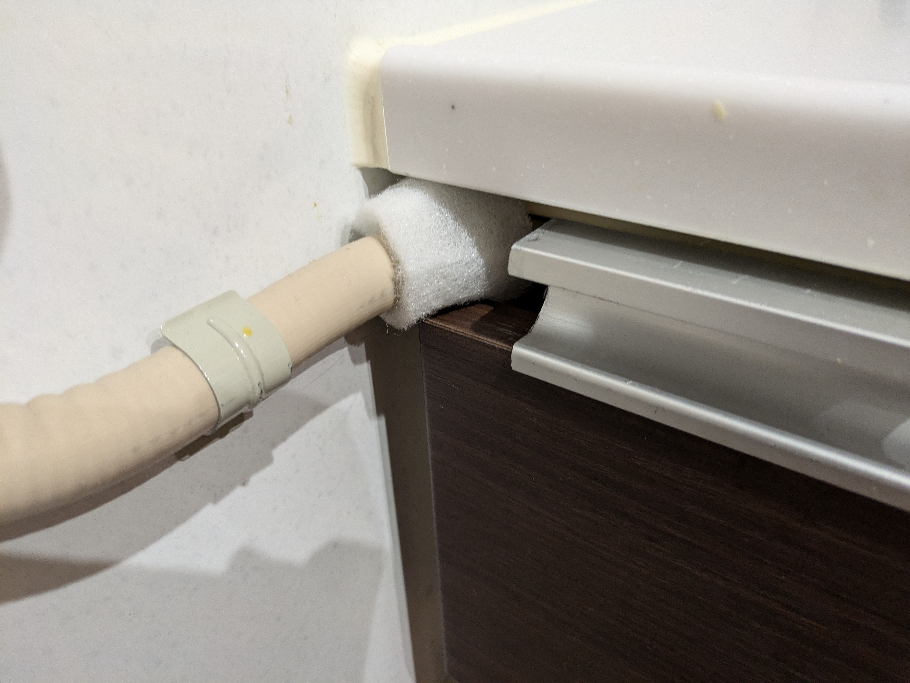
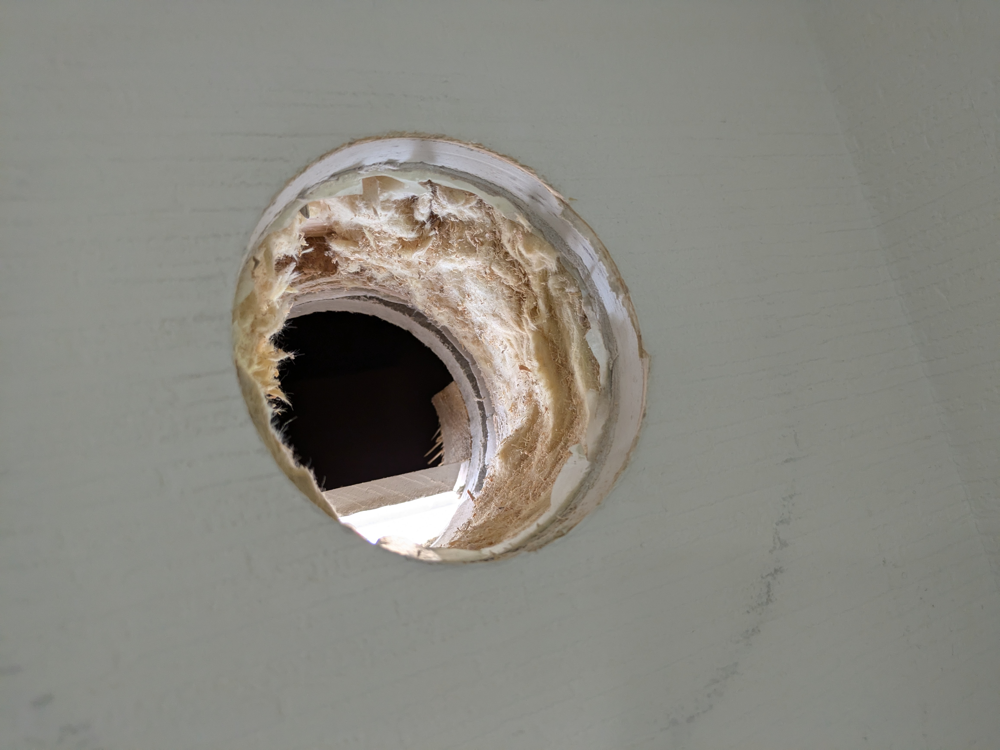
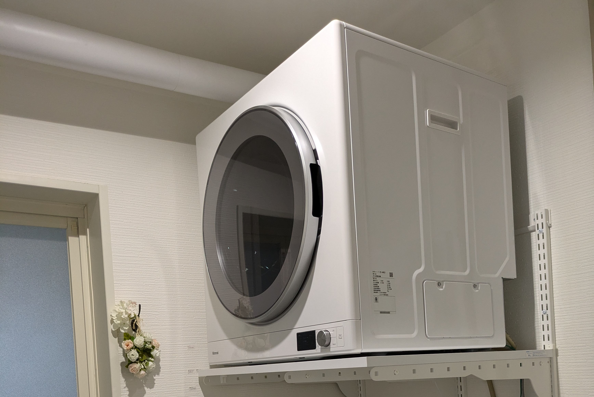
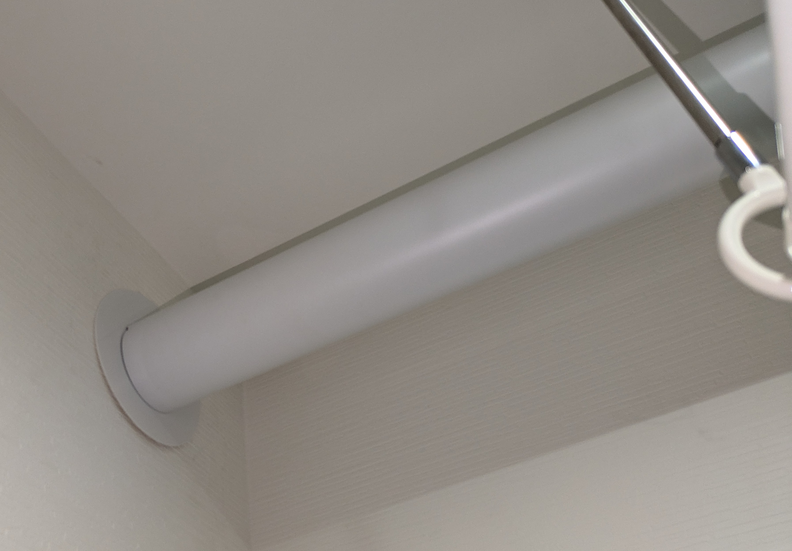

乾太くんを設置するまでの記録。業者選びからの話。アクシデントもあるよ。

狭い場所に設置したい、洗濯機の上に設置したい、気密は担保したい、業者選びに悩む人などに読んでもらえたらいい…かもしれない。

## こうだったらいいのにな乾太くん

- 希望:乾太くんデラックス 6kg（RDT-63U）
- 場所:2階洗面室（一坪）
- ガスコンセントなし
- 洗濯機の上に置く必要あり

狭い2階の洗面室（脱衣室）、洗濯機の上に置くしか選択肢はない。

ガスコンセントつける、乾太くんの台が要る、乾太くんを取付ける。そういうこと。

## 心配なこと

### コスト

ガス工事、乾太くん設置工事。台も必要。2 階だから足場が要る可能性も？高くつきそうな気しかしない。実際高くついた。

最初にガス会社からガス工事〜乾太くん設置まで全部盛り（足場不要）で貰った見積もりでは 60万弱。流石に厳しい。なお見積もり内容は細かく記載してあり妥当っぽかった。ゆえに切ない。

### 気密処理

排湿のため外壁に穴を開ける＝気密断熱層をぶっこわす。リンナイの施工説明書見てもフード周りにコーキングとしか書いてない。何もしなけりゃ外気が入るなり通気層の空気が入るなり色々悪影響がないか？など。

乾太くんから高温の排気が出る、特に冬場はリスクが高そう。回してない時でも排湿管を通って外気が侵入し、暑い寒いだの結露だのが心配になる。温度差があって良いことはないんですよね。

## それならどうするかって

考えすぎなのはわかってる。ほとんどの人は乾太くんを問題なく快適に使っているはず。

しかし気にするのも理由があって。
2階に設置するとなると、一度つけたら自分で補修とはいかない。高所恐怖症だし。少なくとも外側から確認できない。 

だからこそ施工を信頼できる会社を選びたい。
そう、信頼できそうな会社にお願いしたいんだ。

### ガス工事と設置工事を分ける

はじめは一括してガス会社に依頼予定だった。普通そうなのでは？と思ったから。何度かやり取りするうちに多少の不安が芽生え、ガス工事だけお願いすることにした。

誤解なきよう、ガス会社は真摯に対応してくれた。見積もり内容も妥当。コスト高はやむを得ない感じ。分けた理由は施工面の不安。配管経路であったり結露の捉え方であったり。

とはいえ、先方ができうる範囲での提案を貰ったのでガス会社がダメとは全く思っていない。方向性の違いってやつだ。そもそもガス会社にそこまで要求するのもってことだ。申し訳ないと思いつつ、餅は餅屋とガス工事のみお願いして、設置工事は別途工務店に依頼することにした。

設置をお願いした工務店は気密断熱のノウハウに定評のある会社。ダメ元で連絡したところOKとのことでありがたく飛びついた。
後に知ったことだが社長が乾太くんの設置工事は気密施工も重要、という内容の YouTube 動画を出していた。なんという僥倖、それだよ。

### コスト削減策

50 万超の見積もりは流石に目ン玉飛び出た。どうにかして下げねばと考えたのが以下。

- 専用台を自分で調達
- 乾太くんを自分で調達（却下）
- ガス管化粧カバー不使用

#### 専用台自分で買う

リンナイの専用台が置ければそれで良かったが、防水パンの位置が悪く置けず。壁付け棚としてfitrackが候補に。シンプルで良さげ。

しかしガス屋曰く壁を開口、下地を入れて壁を埋めてクロス貼ってと割高になる話…。んが、調べると専用化粧パネルを取付ければ下地なしでもいけるそう。下地工事なしならかなり削減できそう。

fitrackはネットで購入、設置は工務店に任せることになった（ガス屋さんごめんなさい）。なお化粧パネルは結局使わず、間柱とボードアンカーを利用して直接設置となった。工務店曰く耐荷重的には問題ないとのこと。

#### 乾太くん自分で買…わず

乾太くん本体やパーツの自己購入も検討したがやめた。確かにネットで安く手に入るが、そもそも業者によっては自己購入品は対応してもらえないことがある。ガス会社はダメだった。

工務店にはfitrack以外聞かなかったような気がするが、万が一乾太くん本体やパーツに不足や不備があった場合、設置当日になって大変迷惑をかけそうなので思いとどまった。

#### ガス管むき出しスタイル

ガス配管化粧カバーを付けないスタイル。見た目は悪いが少しコストダウン。外壁開口とは違い直しようがあるので多少見た目が悪くてもまぁ…

良い感じにする方法が思いつくまで放おっておこうかとぶん投げておく。というか付いてみると意外と気にならないんでずっとそのままかも。

### 気密の確保策？

ポイントは排湿口を通ってくる外気と、排湿口開口部の隙間の空気の2点かと。

排湿口からの外気流入防止には専用ダンパーを取付ける。これは業者に頼めるし自分でも買える。今回は部材はお任せしたのでダンパーも頼んだ。

開口部の処理は素人には難しいため知識と経験のある業者に頼むしかない。と思う。餅は餅屋のとこ。

排湿管は断熱材を巻きたい。アルミフレキのままだと結露するとの話も。排湿管にぴったりの断熱材があるのでそれでよいっぽい。
→結果的に化粧カバーを巻いてもらった。見た目は綺麗だが影響あるかどうかは使いながら様子を見ていく。

## 工事開始

### ガス配管工事

先行してガス栓の設置。9時〜12時くらいまで。ガスコンロのあたりから分岐して内壁を回って、洗面室の裏から開口して通していく。ほぼ滞りなく進んだようだった。裏側を想定しつつ狙ったところに穴を空けるのは難しそうなのに流石。

改めて写真を撮ったら壁紙傷付いてるけど御愛嬌。

スパイス収納？を潰す感じでガス管を通したが、業者さんの計らいで収納が閉まるように切り欠いてくれた。（微妙に管にぶつかるので傷防止フェルトを巻いている）

### 乾太くん設置工事

いよいよ乾太くん設置工事。

fitrack設置→乾太くん置く→排湿口の開口→排湿管設置のような流れ。
これがまあ大変…9:30から昼くらいで終わる予定がアクシデントもあり15時前までかかった。尽力していただいたスタッフの方には感謝しかない。

別室で仕事中だったのでほとんど作業風景を見ていないが、必要な説明はいただいたし外壁開口部の気密施工はしっかりするとのことで心配はなかった。

#### fitrack取付

まずfitrackを耐荷重考慮の上化粧パネルなしで取付。高さは洗濯パン＋縦型洗濯機も置けるようにとやや高めの150cm程。身長157cmの私だと踏み台が居るが、折りたたみ踏み台があるので問題なし。 

#### 外壁開口でびっくり

乾太くんを置いて排湿管を伸ばし、排湿口の位置を確認。開口する。ここでトラブル発生。壁を貫通した先が軒天にぶつかっている。軒天が邪魔でフードを取付けられない。

裏見えてるー。2階とはいえまさか軒天が出てくるとは。スタッフの方もひどく申し訳無さそうに報告をくれた。DIYをやっていると予想外の事はよくあるので、そうなのか、どうやって対処するんだろうな〜くらいにしか思わなかった。

複数案検討の結果、既存の穴をそのまま使い、外壁側に下げた上で軒天を削ってフードを付ける。ということに。

良きに計らえじゃないが、プロが良いと思うようにしていただければ良いんじゃないか。ということでお任せ。さぞ骨が折れたことかと…なにかあればすぐ連絡してと言っていただきひとまず安心。

軒天はごく一部削れたからといって大きな影響はないんじゃないかと。作業風景、見たかったけど遠慮してしまった。ちょっともったいなかった。

後に聞いたところ、普段は貫通部にスリーブを通すが今回は勾配がついたため使えず、気密テープをスリーブ状に巻いて代用したとのこと。断熱材も埋め、防水役物も使って処理したそうでリカバリーは万全そう。部材が揃ってるのも流石。

#### 乾太くん設置

時間は押してしまったものの、その後問題なく乾太くん設置完了。長時間の作業に頭が下がる。用意した飲み物を渡しそびれてしまい申し訳なかった…。

排湿管カバー。見た目きれい。

凸凹した壁紙に貼ったメガネリングは剥がれ気味（問題なし）。隙間から気密テープが見える。

## 気密に自信工務店で良かった

あくまでわが家の場合としてだけども、ガスと設置工事は業者を分けて良かった。

まさかの事態が自宅で起こるとは思いもよらずで。こんな時に住宅のノウハウがある工務店だと「なんとかしてくれるはず」と落ち着いていられる。

もしガス屋に乾太くんまで頼んでいても同じトラブルに遭ったはず。（同じ高さでの開口見積は貰っていた）どう直しただろう？あくまでガス工事のプロであって住宅構造を考慮して直してくれるかは少し疑問。少なくとも安心できるほどの処置は期待できなかったなと。

報告を受けたときは驚いたが、気密施工に自信を持ってる工務店にして良かったと痛感した。アフターとして万が一なにかあっても相談しやすい点もよい。

ちなみに費用はガスで10万超え〜の乾太くんで30万くらいの、で40万ちょい。高い。けど、元々60万の見積りがあったことや諸々考えると納得感はある。（物価上昇世知辛いなぁ。）

## 乾太くんを検討している方へ

ケースバイケースだし偉そうなことは何も言えないですが…私の経験から言えるのは

- 先にガスの準備だけ済ませるのもアリ
- 外壁開口は最低限に（気密）
- 外壁開口部にスリーブはアリ（気密）
- 逆流防止ダンパーはつける（気密）
- 排湿筒の距離は最短を目指す（節約）
- 節約しすぎもリスキー
- よさげな業者がいればぜひ相談
- デラックスタイプのフィルター位置最高

乾太くん設置は想定外に大掛かりで、素人が手を出すのはまぁ無理。信頼できる業者こそが何よりだと感じました。

乾太くんの感想（乾燥機だけに）はまた別記事で。評判に違わず最高ですね。
