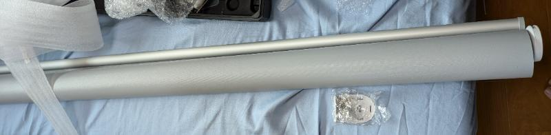
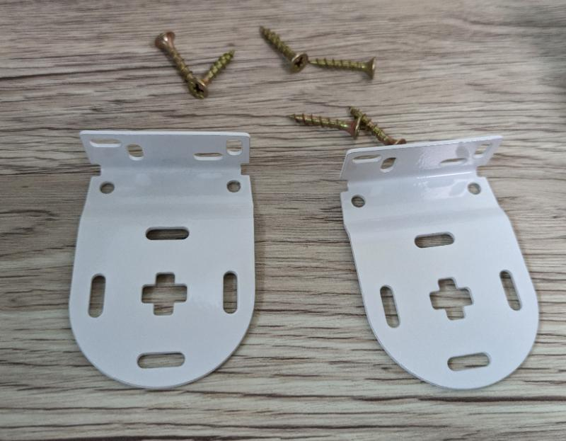
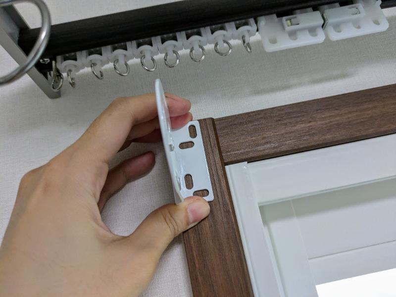
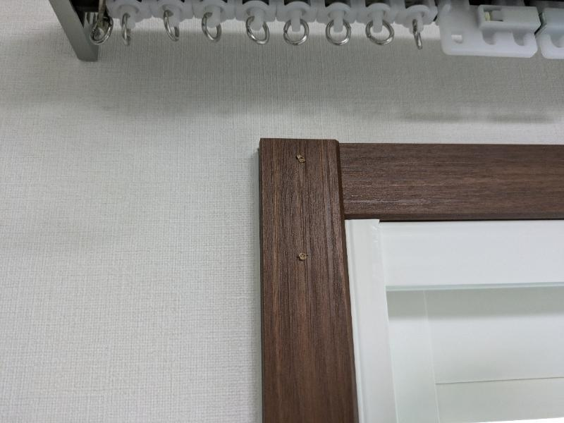
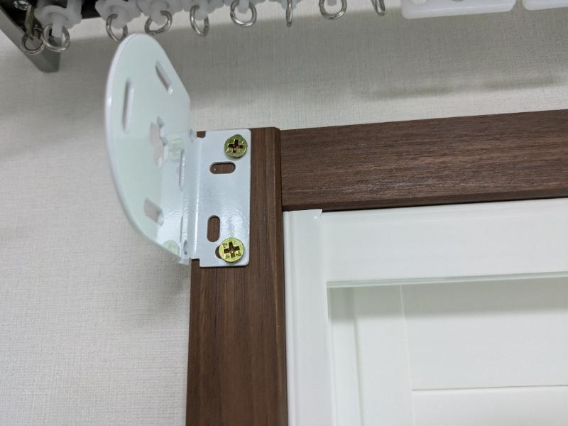
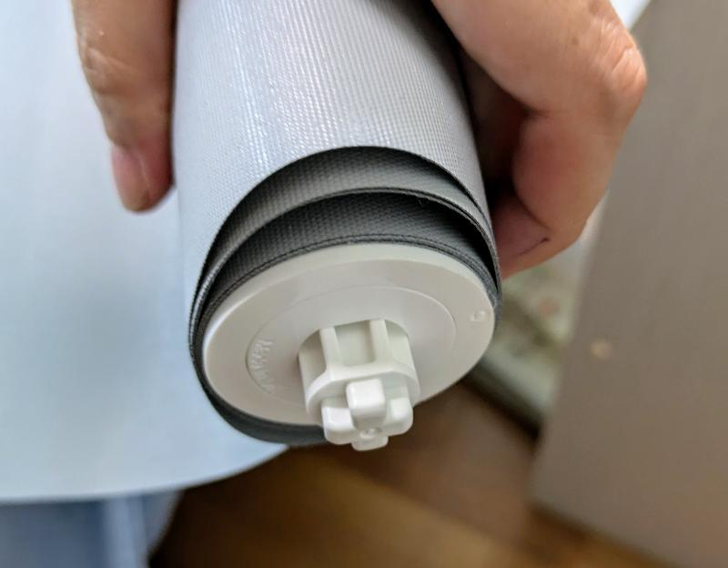
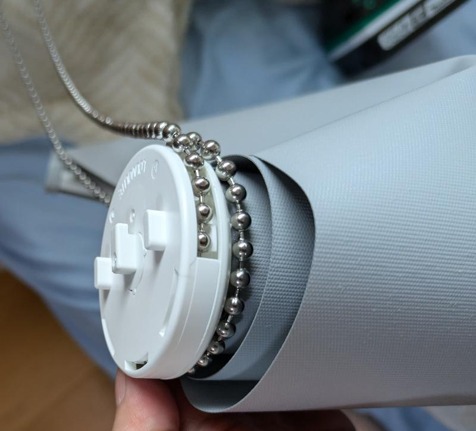
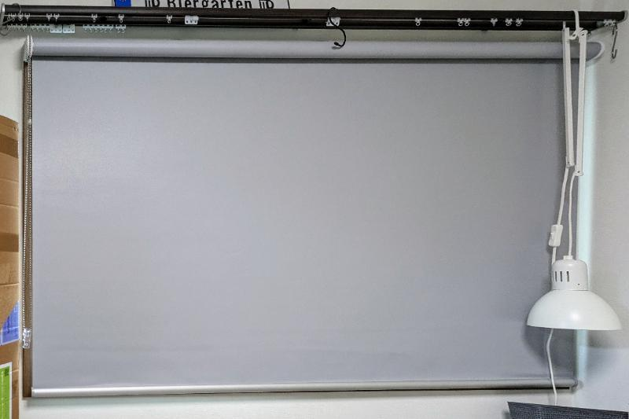

[Tuiss decor](https://www.tuiss.co.jp/)でロールスクリーンを購入、正面付けで取付た。この記事では使用付けロールスクリーンの設置について書いておく。
今回は内窓設置済みの窓に[遮光のチタン シンプルグレー](https://www.tuiss.co.jp/%E3%83%AD%E3%83%BC%E3%83%AB%E3%82%B9%E3%82%AF%E3%83%AA%E3%83%BC%E3%83%B3/24445/%E3%83%81%E3%82%BF%E3%83%B3_%E3%82%B7%E3%83%B3%E3%83%97%E3%83%AB%E3%82%B0%E3%83%AC%E3%83%BC)を取付ける。PR ではない普通の感想記事。

https://www.tuiss.co.jp

購入時の流れから書いているため、[取付作業まで飛ぶならこちら](#開梱取付作業)

## 購入時に考慮すること

購入前に把握しておくべきこと。

tuiss はネット販売なもんで当然取付作業は自分でおこなわねばならない。失敗しても自己責任。失敗しないよう作業の流れをイメージして、必要な情報をまとめておきたい。公式ドキュメントはすごく簡素なので DIY 初心者には分かりづらいと思う。

### 設置窓のサイズ

窓の縦横サイズ。cm 単位でも mm 単位でも注文できる。どっちでもいいけどね。

天井付けか正面付けかで採寸方法が異なる。天井付けなら取付幅そのまま（窓枠内なら枠内サイズ）を採寸。正面付けなら窓枠の外寸を測る。詳しくは公式の採寸方法を参照のこと。

https://www.tuiss.co.jp/%E6%8E%A1%E5%AF%B8%E6%96%B9%E6%B3%95

今回は窓枠に直接正面付けするので、窓枠外寸を測った。100 均のメジャーなど安いものはズレがあるかもしれないとこのとで、しっかりした商品で測ると安心かと。[タジマのコンベックス](https://amzn.to/3X4CPZ5)とか。

  

    

      

        
        
      

    

    

      

        <a
          class="paap5-pa-product-title-link"
          href="https://www.amazon.co.jp/dp/B000AQSCGS?tag=ctc-22&amp;linkCode=ogi&amp;th=1&amp;psc=1"
          title="N/A"
          target="_blank"
        >
          [タジマ(Tajima) コンベックス 5.5m×19mm Gロック19
          GL1955BL](https://amzn.to/4dKLTYz)
        </a>
      

      

        
      

      

        
      

    

  

### 設置方法をどうするか

天井付け：天井や窓枠内上部に取り付ける。窓枠内側に収まる。
正面付け：窓枠自体や壁面に取り付ける。窓枠外につく。
突っ張り：窓枠内で突っ張って取り付ける。窓枠内側に収まる。
カーテンレール：カーテンレールを利用して取り付ける。プルコード式のみ選択可。

今回は窓に内窓がついているため、窓枠内にスペースがなく正面付けを採用。

### チェーン式かプルコード式か

チェーン式：チェーンを引いて上げ下げ。右側か左側か選択可。
プルコード式：コードを引いて上げ下げ。真ん中にコードがつく。カーテンレールへの取り付け可。ちょっと高くなる。

今回は特にプルコードにする理由がなかったのでチェーン式を選択。

### 下地の有無

ビス止めする（天井付け、正面付けの場合）場所にねじが効くか確認。窓枠に直接つけるなら問題なしと思われる。壁付けするなら石膏ボードの裏に下地（柱）がないとビスから外れ落ちる可能性があるので要注意。[下地探しどこ太](https://amzn.to/3SPDLhz)で細かい場所も確認したい。

## 注文

注文時には採寸を間違っても再制作を依頼できる保証サービスもある。

ケチってお願いしなかっため、入念に採寸した。
正面付けの場合は窓枠外側の横幅ぴったり 1,665mm。縦は幅ぴったりよりも少し長めの 1,010mm で注文した。

## 開梱、取付作業

ダンボールを開けるとロールスクリーン本体、取付用ブラケット、ネジが入っている。

この窓に設置する。

### ブラケットの取付

ブラケット。ビスは 6 つあり、ブラケット 2 つ ×2 個ずつとチェーン止めに 2 個使用する。

窓枠の一番端に金具の端が来るようにあてがい、ビスを打つ位置に印を付けておく。

ブラケットには縦横長の穴が 4 つあり、そのうち 2 箇所を使って止める。横長と縦長をそれぞれ 1 つずつ選んで、位置を微調整しつつビスを打つ。

窓枠の端ギリギリにビスを打つとビスがはみ出すおそれがあるため外側には打ちすぎないほうがベター。

下穴を開けておく。

ブラケット取付。ちょっと曲がってしまったが仕方ない。完成後はまったく気にならないので問題なし。
今画像を見て思ったが、ブラケットはもう少し外側（左側）でも良かったのかもしれない。この後の本体設置で結構ギリギリだった（気がする）ので。

同様に逆側にもブラケットを設置する。

### 本体の設置

本体はブラケットの+形状の穴に差し込むかたちで設置する。

本体片側が押すと引っ込む+状の突起になっている。

反対側は引っ掛けられる形状の突起になっている。

まず引っ掛けるほうの突起を片側のブラケットにはめ、+状の突起を指で押し込みつつ逆側のブラケットにはめ込む。結構力が要ったが、ブラケットの設置幅をもう少しだけ広くしていればもっと楽に入ったのかも、と思う。逆に言えばギリギリ気味でもしっかり入るということ。

## 設置完了と感想

無事に取付完了。要所を確認しつつ行えば、女性 1 人でも難なく設置できた。これ以上幅があると 2 人での設置が望ましいと感じた。

グレーのロールスクリーンはどんな部屋にでも馴染む。インテリアの好みが変わっても生き残れるはず。

1 級遮光ということで、下げていると明るさを感じない。西側の窓だが西日もなんのその。遮光のおかげで遮熱もできていると感じる。

正面付けはやや窓枠が見える。白い窓枠だとより自然だろうので、マスキングテープや塗装などで色を変えてみるのもいいかもしれない。アクセント的に色を入れても良さそう。

カーテンレールは不格好だが何かに使えるかもしれないのでそのままにしている。

ロールスクリーンにしてよかったのは窓周りがスッキリしたこと。カーテンとレースカーテンを下げていた時は嵩張って窓周りに圧迫感というか、「見えない、使えない壁」かあって邪魔だった。ロールスクリーンは無駄がなくて良い。

TUISS は良心的な価格かつ品質も良いと感じたので、機会があればまた利用したい。断熱性能のよいハニカムシェードや調光ロールスクリーンなどのバリエーションも豊富なので一度覗いてみてはいかがだろうか。

https://www.tuiss.co.jp/
