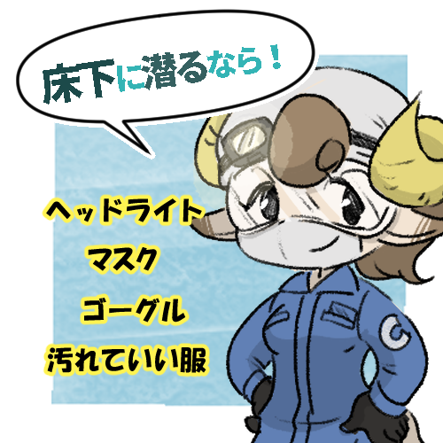
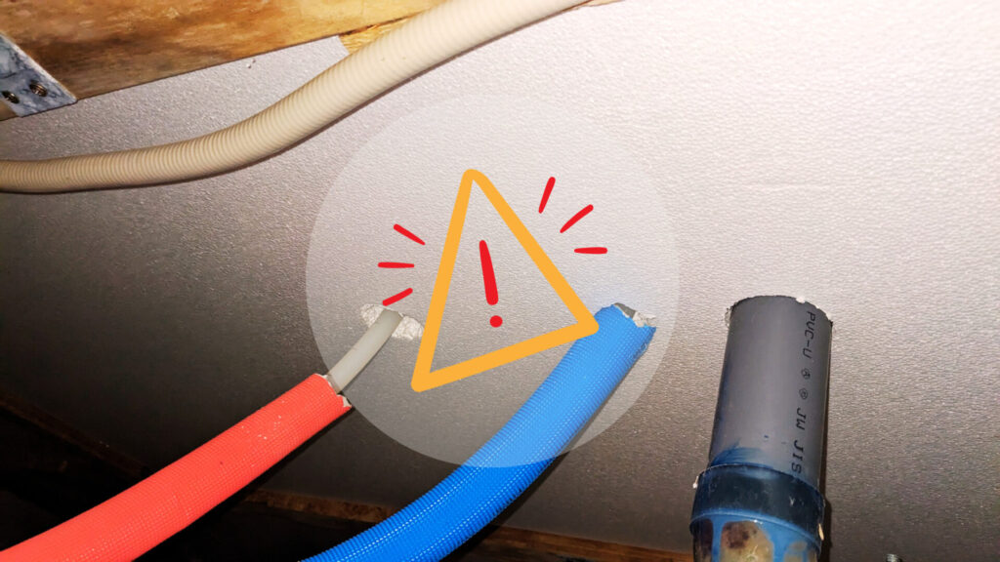

※できるだけ事実に基づいて記事を書いてはおりますが、caori の主観が多く含まれている点をご了承ください。

誰でも最初は素人である、ということで。  
床下に入るのはなかなか抵抗があるかもしれません。素人が入るには多少の事前知識があると安心です。

床下って自分には関係ないんじゃ？実際、普通に暮らしていればあまり関わりません。  
ですが…DIY や住宅がお好きなら面白く感じるかもしれません。床下を見れば家全体の状態を把握できる・床下状態は住宅の健康状態の目安、とも。なんだか気になる場所なのです。少しでも興味がありましたら読んでいただけたらと思います。

当記事は基本的に新築やベタ基礎の床下を対象にしています。築年数の経ったもの、布基礎の家には当てはまらないことが多々あるため参考になりません。  
また、閉所恐怖症の人・かなりカビ臭い・汚い・漏水してる…など不安があれば立ち止まるのも正解です。ご安全に。

## 大丈夫、床下はそんなに怖くない

まずお伝えしたいのは、床下はそこまで怖いところではないということ。いきなり入らなくてもいいんです。  
床下点検口を開けて、ライトを照らして眺めてみてください。床下がこんなつくりになってるなんて面白くなってきませんか？少しの興味が出てきたら、一歩踏み出すのもいいかもです。

## 床下に潜るのに適した時期

### 虫嫌いなら冬がおすすめ

もちろん好きな時に潜れば OK。ただ、もしあなたが虫が苦手なら冬の時期に床下に入ることをお勧めします。何を隠そう私も虫が大の苦手です。(虫対策によって温かい季節でもほぼ目立つ虫は見なくなりましたがまた別のお話で)

床下で出会う可能性のある虫たち…G さんやカマドウマ、小さなヤスデ？にクモなど。彼らは通気口・通気パッキンなどから入ってきます。  
入ったはいいものの出られずに死んでしまったり、もし環境が合えばそれなりに生き残ったり。死骸であればまだ怖さが少ないのですが、生体と鉢合わせると流石に驚いてしまいます。彼らの繁殖や動きが鈍っている冬は、虫が苦手な方の床下チャンスかもしれません。

冬に床下なんて寒いんじゃ？とお思いかもしれませんが、意外と問題ないです。  
床下は比較的気温が安定していること、狭い空間で動いているうちに体が勝手に温まることなどから気温はそこまで気にしなくても大丈夫かと思います。

### 夏はひんやり気持ちいい

逆に夏は向かないのか？といえばそうでもなく。床下のひんやりとした空気が心地よいですよ。洞窟やワイン貯蔵庫に入った気分を味わえます。どちらも入ったことありませんが。

床下へは好きなタイミングで入って OK、少しでも虫や暑さを逃れるなら冬がおすすめ。そして何より大事なのは自分の体調が良いときに。

## 床下に潜るのに最低限必要なもの 4 つ

1. 汚れてもいい服、靴

2. マスク

3. ライト

4. 保護メガネ

### 1.汚れていもいい服、靴

1 つめは汚れてもいい服。床下はホコリやゴミ、虫の残骸や使い残しのビスなども落ちているかもしれません。そんな場所を這いつくばって移動するので、体中ホコリだらけになってしまいます。ぜひ汚れても良い服を着てください。頭も床下に擦れたり、寝転がって移動する際に汚れてしまうのでフードやタオルを巻くなどしてカバーしたいですね。

不織布の使い捨て防護服なども販売されており、汚れてもそのまま捨てられて便利そうです。靴も同様に汚れるので、履き古したものかつそれなりに強度がある靴をおすすめします。

### 2.マスク

2 つめはマスク。ホコリっぽかったりカビっぽかったり、直接吸って気持ち良い空気ではないので必須です。個人的には少し潜ってみる程度なら防塵マスクまでは要らないかなと思います(個人の感想です、防塵がベターではあります)。私は発泡ウレタンスプレーを吹くなど、吸い込みたくない気持ちが強いときには防塵マスクをしています。

カビの胞子が飛んでる可能性もあるので、アレルギー持ちの方は特に大事ですね。というかアレルギー酷い方は床下やめたほうがいいと思いますが…

### 3.ライト

3 つめはライト。おすすめは充電タイプのヘッドライトです。ヘッドライトをしていれば自分の向いている方向が照らされるので作業性が良いです。それにプラスしてスマホのライトや置き型の照明を持っていると便利かつ安心です。私はヘッドライト+スマホで十分使えています。長時間潜ったり、広く見渡したいときに置き型を併用しています。

### 4.保護メガネ

最後は保護メガネ（保護ゴーグル）。上を向きながらの移動や作業も多々出てきますので、メガネは是非身につけておきたいです。ないと得体の知れない粉塵が直撃する、と思います…。

普段お使いのメガネがレンズ大きめならそれでも OK かもしれません。私は作業場所が自宅、かつ作業が軽いものなら「いつものメガネ」です。時々ゴミは入ります。メガネを大切にしたい方、コンタクトや裸眼の方は防護用ゴーグルをお使いください。お安く手に入ります。メガネ on ゴーグルができるものもあります。気温が低いと曇りやすいのが玉にキズですが、持っていて損はありません。

基本的に上記 4 つあれば問題ないと感じています。

### その他あると便利なもの

- つなぎ

- クモの巣払いの棒

- 作業道具入れの箱(キャスター付き)

- 肘膝サポーター

- ヘルメット

- ヘアキャップ(シャワーキャップのようなもの)

- キャスター付きボード

その他あると便利なものとして、ポケットが多くはだけにくい作業着であるつなぎ。クモの巣を巻き取るための適当な棒。作業道具を入れておくちょっとした箱（キャスター付きが便利）、人が乗る移動用のキャスター付きボードなんていうのもありますね。こういったものは必要性を感じたら、で良いかと思います。

私は断熱材を入れたり気密テープを貼ったりと作業が多いため、道具箱は欠かせません。肘もアザだらけになるのでサポーターが欲しい。頭もボサボサになるし汚いのでヘルメット、ヘアキャップも欲しい。キャスターボードは…配管が多いあたりでなければ便利そうだと思います。

個人的に必要なもの、あったら良いと思うものを挙げてみました。個人の感想なので、人によっては不足や多すぎる感じがあるかもしれません。これ便利だよ！というモノがありましたらぜひコメントくださいませ。

## 床下に入ったら気をつけるべきこと 5 つ

最後に、心構え的に気をつけたいことリストです。

### 1.ライトは必ず充電

暗い床下の生命線、ライト。特にヘッドライトは十分に使える状態にしておきましょう。

### 2.点検口のある部屋の照明を点けておく

点検口のある部屋の明かりが入ってくるため、万が一ライトが切れたときでも点検口付近の明かりが担保されます。

### 3.周りをよく見て移動する

床下には思わぬものが落ちていたりします。ネジや釘、ゴミなど…引っ掛けると怪我のおそれがあるものが落ちているかもしれないので、周囲をよく確認して進みましょう。上面も金具やネジの飛び出しなどないか見回しましょう(めったにないと思いますが…)。

### 4.配管を壊さない

床下にはたくさんの配管が走っています。トイレや浴室、キッチンなどの水回りやガス配管など。これらをうっかり破壊してしまうと致命傷です。漏水など一大事に繋がりかねませんので、配管周りは注意して移動します。くれぐれも体重をかけたり足を引っ掛けたりしないようにお気をつけください。

### 5.ほどほどで帰る

無理は禁物です。狭い空間での活動は思いのほか体にきます。気づかぬうちにアザができていたり、筋肉痛に見舞われたり…。急ぎの用でなければ疲れたらほどほどで切り上げることが大切だなと感じています。床下はいつだってそこにあるのですから。

## 床下作業が向いている人

最後に向き不向きについてです。やはり個人の気持ちにお任せなのですが、あえて挙げるとすれば。

小柄で静かなところが好きな人が向いているのではないでしょうか。高身長の方、恰幅のいい方は点検口から入るのも大変、狭い床下で動くのも大変です。単純に小柄な方のほうが小回りがきくということですね。細い道に 4t トラックが入れないようなものです。

また、静かなところ、人とエンカウントするのを苦手とする方は向いているかもしれません。虫とはエンカウントしますが。床下空間は基本的に薄暗く静寂です。通気口からうっすら漏れ出る光も何となく落ち着きます。

## 無理せず適度に床下探索を

気負わず、適当に。一度チャレンジして合わなければそれでもいい。床下なんて一生に一度も入らない人だってたくさんいるんですから、入ろうが入らなかろうがどちらでもいいのです。

施主・住んでいる人が入るのはあくまで興味や趣味の延長ではないでしょうか。プロのような装備や観察眼、知識はプロにお任せすれば良いのです。あくまで自分はアマチュアであるという認識は大事ではないでしょうか。更に突き詰めたい方はプロ並の勉強をしていけばまた楽しいですしね。

床下は素人でも入れる、家の一部です。重ね重ね無理せず楽しく潜ってみてはいかがでしょうか。
