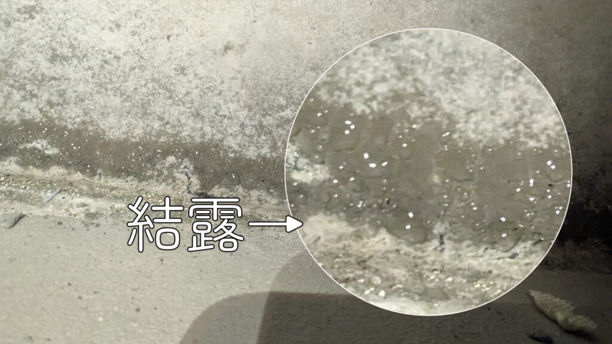
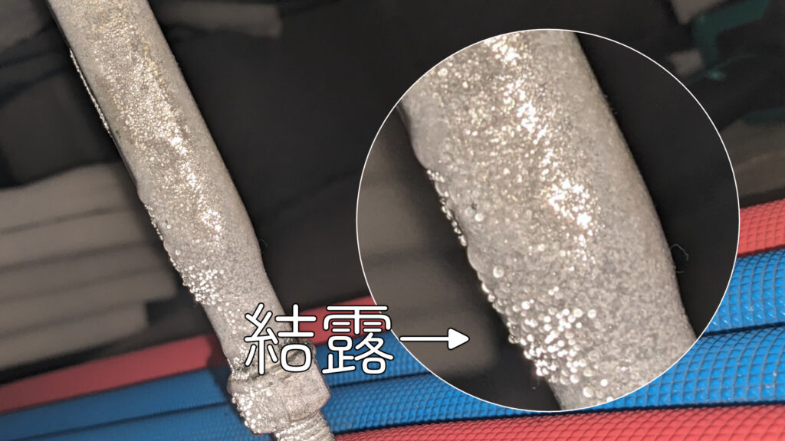
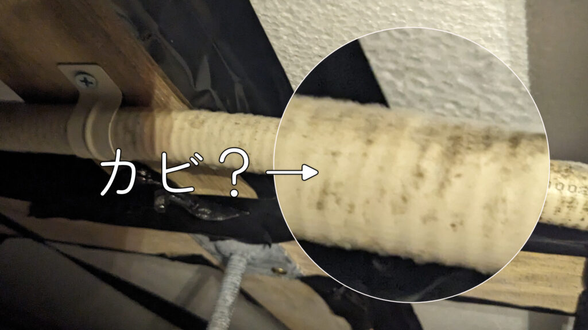
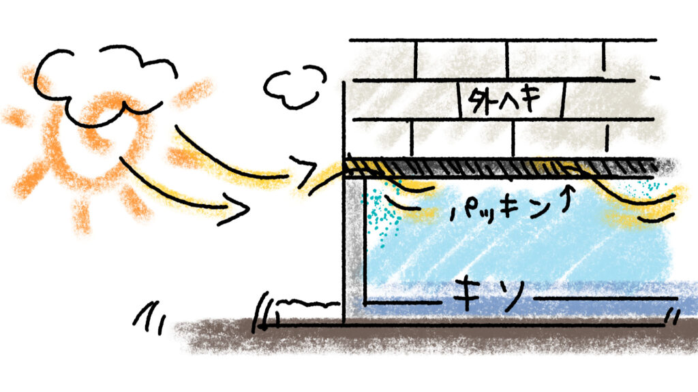
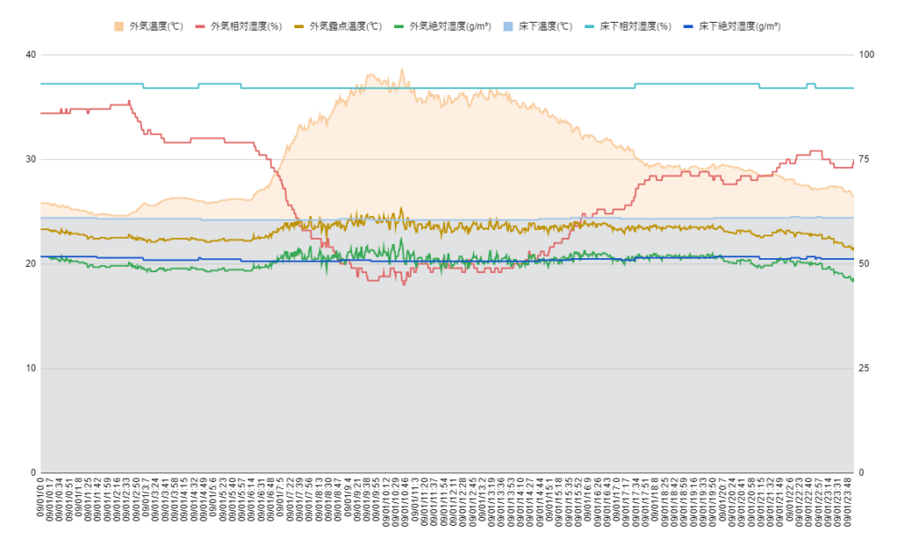
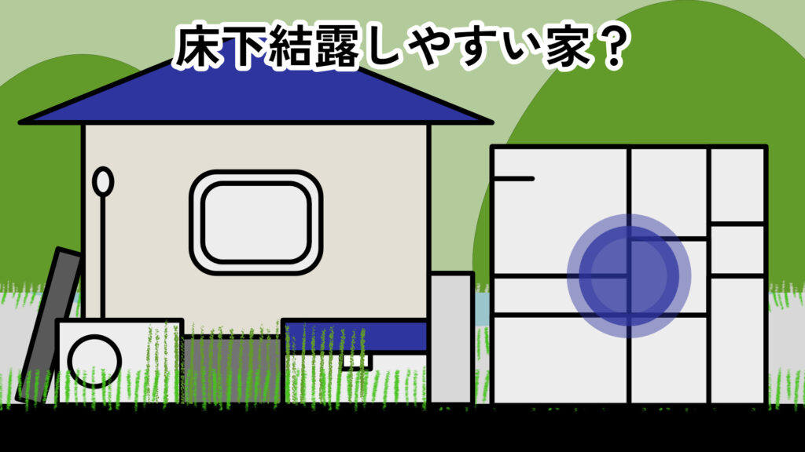
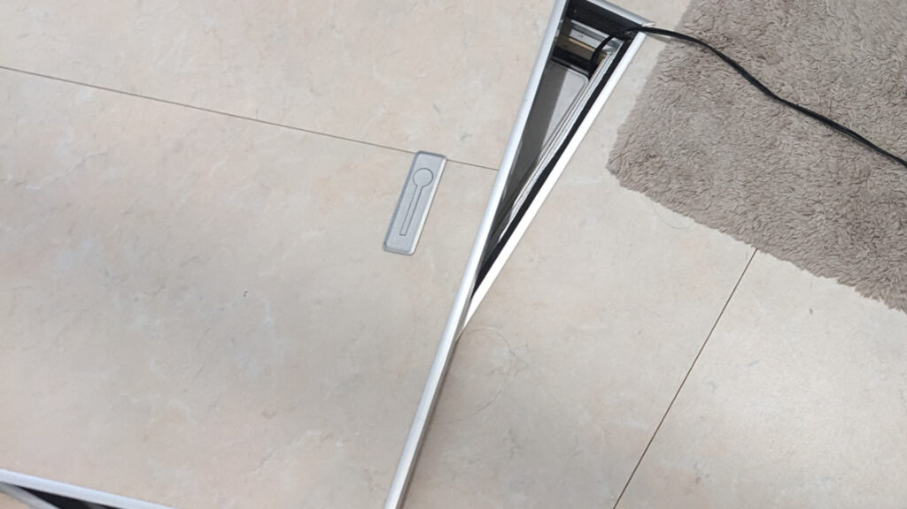

夏、床下に潜ったら結露を見つけました。いつものように床下に潜っていたらいつの間にか手が濡れており、最初は何なのかわからず水漏れか？と。よくよく周りを見渡し、触ると…これは結露…！

濡れているのは断熱材、ガス配管、鋼製束、基礎立上り部など様々。ガス配管には菌糸？のようなふわふわとしたカビも見えました。

結露にカビとは気持ちの良いものではありません。床下の夏型結露、知識としては知っていましたが自宅で起こっているとは…。

結露の原因や対策、温湿度の変化などをまとめてみました。

※ベタ基礎・床断熱のケースです。

## 床下が結露する理由

まず基本的なところから。**結露は湿気を含んだ暖かい空気が冷やされることによって起こります。**気温が高いほど保持できる水分量が多いものの、冷やされると水分を保てなくなり結露として表面に出てきてしまうわけです。床下（床断熱）は地面に面していて日も当たらないため気温はある程度安定しています。冬は外気よりも暖かく、夏は涼しいです。2023 年猛暑の仙台での床下温度は平均的に 24℃ 程でした。

結露を発見してからというものの、床下環境を計測したくなり[SwitchBot の防水温湿度計](https://amzn.to/48f02LX)を購入。床下と外に設置。

2023/9/1 9 時を見てみます。

|          | 外気    | 床下      |
| -------- | ------- | --------- |
| 温度     | 35.6℃   | **24.3℃** |
| 相対湿度 | 50%     | **92％**  |
| 絶対湿度 | 21g     | 20g       |
| 露点温度 | **24℃** | 23℃       |

外気温と床下は約 10℃ の差、相対湿度は 40%の差。外気の露点温度が 24℃ なので、**床下に外気が入って 24℃ 以下のものに触れると結露する**という訳ですね。床下温度は 24.3℃ なので、ギリギリというか場所によっては結露していると思います。

8 月末〜9 月中旬までの床下の湿度を見ると 90%を下回ることはほぼなく、96%にもなることもしばしば。夏はずっとこんな感じでしょう。そりゃ結露するわ。

結露を発見した時の時間帯は午前中、昼前くらいだった記憶。涼しい床下に気温が上がった外気が入る。鋼製束や配管など表面温度が低めの所を中心に結露する、と考えられます。

結露の仕組みとしては上記のようなものですが、これだと床断熱の住宅は皆結露することになってしまいます。実際結露しているお宅はそんなに多いのでしょうか。珍しくもないけど、多くもないのではと。ということは**結露しない＝相対湿度が下がっている状態になれば OK**ということですね。床下湿度が 90%を超えると結露リスクが上昇、80％以下であればカビの成長も抑制されるという研究結果があります。更に基礎の外周よりも中央部が温度が低く結露しやすいとのことです。（参考：[床断熱工法住宅の床下温湿度環境の実態調査と高湿化抑制手法に関する調査研究](https://www.jstage.jst.go.jp/article/aije/83/753/83_901/_pdf#:~:text=%E7%9B%B8%E5%AF%BE%E6%B9%BF%E5%BA%A6%20%E3%81%A7%E8%A6%8B%E3%82%8B%E3%81%A8,%E3%81%82%E3%82%8B%E3%81%93%E3%81%A8%E3%81%8C%E7%A2%BA%E8%AA%8D%E3%81%A7%E3%81%8D%E3%82%8B%E3%80%82)）

### 床下換気で相対湿度を下げたい

結露の原因が外気との温度差にあるなら、同じ床断熱でも温度差を少なくできれば結露しにくいはず。逆に言えば**温度差がありすぎるから結露しやすい**と。

床下の換気に関しては空気を動かしてカビや腐食予防というのがセオリーですが、夏はそもそも外気の温湿度が高いので換気しても絶対湿度はあまり下がりません。換気の目的は絶対湿度を下げることより、**「外気の高い気温を取り込み相対湿度を下げる」「空気を循環させて温度を一定にする」**にあるのではないかと考えました。

また、**換気量を増やし外気の変化に床下の温度をついていかせる**ことも大事だと考えます。基礎の換気量は大抵の場合足りていないそうです（参考：[戸建住宅の夏季における床下高湿化及びその対策に関する研究](https://kitakyu.repo.nii.ac.jp/records/981)）

### 断熱性能によって結露リスクが変わる？

床断熱の性能が低いほど結露しにくく、高いほど高リスクという話もあります。断熱性能が低ければ一階の室温が床下に影響しやすい。夏の床下温度は 24〜5℃ くらいなので、室温はそれより高いことがほとんどでしょう。床下が温められて飽和水蒸気量が上がり、相対湿度が下がるというわけです。

とは言っても結露するかどうかは他の要因（換気量や基礎区画構成、周辺環境など）の影響が大きいそうで、床断熱の性能はあくまで一因ということのようです。高断熱住宅=結露ではないですしね。

### 結露（湿度上昇）原因まとめ

ざっと考えうる床下結露の原因を挙げてみます。

- 床下換気量が少ない

- 床断熱材が厚い

- 基礎立上りが多い、区画が複雑

- 基礎周りに通気を妨げるものがある

- 近くに水場がある

- その他、盆地など地域的なもの

地域的なものは仕方ないですけどね。

## わが家の床下結露の原因を考える

ではなぜわが家の床下で結露したのか。なぜ相対湿度がに 90％超えと高いのか。

### 床下結露の具体的な理由？

1. 北面は玄関が 2 箇所あり気密パッキン＝ 2/3 ほど換気不可になっている

2. 南面は全面ウッドデッキ、更に荷物があるため通気しづらい

3. 西面は塀が近いのでやや通気しづらい？

4. 洗面や WC、玄関近くの基礎立ち上がりが入り組んで通気しづらい

5. 付加断熱により基礎パッキンが一部隠れてしまった？

6. 付加断熱中で断熱材を床下に置いていて通気が妨げられた？

7. そもそも仙台は夏に湿度が高い地域だった

考えうる原因を列挙してみました。  
1 ～ 4 は構造的な問題なので如何ともし難いですが、ウッドデッキ下や基礎周りの整理整頓で多少改善できそうです。北側に玄関 2 つ並べるのは断熱性の面からもつくづくミスでした。北と東 or 西など方角を分けるとよかったかなと。

4,5 は今年床に断熱材を追加しており、床下にモノを置きっぱなしにしましたし、一部基礎パッキンに断熱材がかぶったりなどがあったかもしれません。できるだけ塞がないように怪しい箇所はスペーサー（断熱材の端切れや塩ビパイプの端切れですが）を挟んで通気を阻害しないように気をつけていますが、完璧ではないため今後手を入れていく必要はありそうです。

7 の地域性。どうやら私の住んでいる仙台は夏蒸し暑い地域らしいです。仙台から出たことがないので気にしていませんでしたが、確かに夏の夜によく霧が出ていました。海からの南風の影響らしいです。そんならある程度仕方ない。

## 床下結露の対策を考える

あらかた原因が出たところで対策を考えます。と言っても目新しいものはなくほぼ定番ですね。

1. **基礎外周部の整頓**

2. **床下を直接換気する**

   - 床下換気扇の設置

   - サーキュレーターで一時的に回す

   - 送風ファンを設置する

3. **床下調湿材を使う？**

   - ゼオライト系（[床下カラッと](https://amzn.to/3PvFVk6)とか）

   - 炭系（[炭八](https://hb.afl.rakuten.co.jp/ichiba/359fb810.20ce6dcf.359fb811.4dd360ef/?pc=https%3A%2F%2Fitem.rakuten.co.jp%2Fhomedeco-outlet%2Fsumi-yukashita8%2F&link_type=hybrid_url&ut=eyJwYWdlIjoiaXRlbSIsInR5cGUiOiJoeWJyaWRfdXJsIiwic2l6ZSI6IjB4MCIsIm5hbSI6MSwibmFtcCI6InJpZ2h0IiwiY29tIjoxLCJjb21wIjoiZG93biIsInByaWNlIjoxLCJib3IiOjEsImNvbCI6MSwiYmJ0biI6MSwicHJvZCI6MCwiYW1wIjpmYWxzZX0%3D)とか）

**根本的な解決には 1、2 が必要**だと思います。1 はできるだけ基礎の周りに物を置かないとか風通しよくしておこうってことですね。

個人的に 3 の調湿剤はあってもいいかな、くらいで。調湿剤って床下に敷き詰める形になるので、数も居るし敷くの大変だし(新築やリフォーム除く)敷いてあると床下潜りづらいし、でデメリットもあるなと。試しに炭系の調湿剤を 1 坪分くらい敷きましたが、これだけでは目に見えるような効果はありませんでした。

### 床下換気扇について

ほとんどの床下換気扇はしっかり通風口（四角い穴）が開いてる基礎向きの商品が多いです（参考：[三菱床下用換気扇](https://www.mitsubishielectric.co.jp/ldg/ja/air/products/ventilationfan/others/advantage_01.html)）。通風口ありならこういった商品は信頼度高いですね。ただ、わが家もですが基礎パッキンで換気をするタイプの住宅だと選択肢は限られます（参考：[SEIHO 基礎パッキン用専用ノズル](https://www.seiho-sdk.co.jp/products/636/)）。専用の床下換気扇を設置するのはややハードルが高い。

### 送風ファンでの自作について

送風ファンを購入して DIY 床下換気扇！をされている方もいらっしゃるようです。電気工事士の資格をお持ちだったり、床下に配線を回せる環境ならありかも。万が一漏電などあっては大変なので、床下という見えないところの DIY 設置はある程度スキルのある方向けかとは思います。私も検討しましたが、資格なしでできることは限られてしまい断念しました。そもそも線が床下に入れられない。

### 手軽なサーキュレーター

サーキュレーターを使う、が私が今取れる策でした。使い方は簡単、床下点検口を開けてサーキュレーターを入れて回すだけ。

床下の結露が気になるのは主に夏なので、気になるときにサーキュレーターを回せば長期的な高湿状態にはならないのではないでしょうか。外気温が下がるにつれて湿度も下がるため、夏場だけちょっと手間をかけるのも一つの手かなと。

### 効果的に換気するなら外気を知る

床下換気扇なりサーキュレーターなり、床下換気にあたっては外気の状況も考慮したいところ。できるだけ湿度が低いときを狙って換気したい。まぁ現実は夏なんて毎日高温高湿ですけども。

あくまで想像ですが、床下と比べた外気の状態によって換気でどうなるかを考えてみました。

| 床下に比べた外気の状態 |                                                                                                      |
| ---------------------- | ---------------------------------------------------------------------------------------------------- |
| 高温高湿               | 床下温度を上げて相対湿度を下げられるが、高温のため換気当初で結露リスクあり。高湿なため湿度下げにくい |
| 中温高湿               | 結露リスク少ないが高湿なため湿度下げにくい                                                           |
| 高温低湿               | 相対湿度を下げられるが、高温のため換気当初で結露リスクあり。低湿なため湿度下げやすい                 |
| 中温低湿               | 結露リスク少ない、低湿なため湿度下げやすい                                                           |

床下の温湿度にもよりますが、ベストなのは外気が中温低湿。高温時は結露リスクはあるものの相対湿度自体は下げやすい。**と思う**。よって、結露リスクの低い外気温が比較的低いとき（例えば早朝）に換気を始める → 外気温が上がって相対湿度下がる、という方法などもアリかなと。完全に机上の空論なので鵜呑みにしないでくださいね。

何にせよ外気と床下の環境計測が必須なので、アプリで確認できる温湿度計の導入をおすすめします。私は[SwitchBot 防湿温湿度計](https://amzn.to/44WYtzm)を使っていますが、[Tapo](https://amzn.to/48pgcCg)などからも手頃な価格で販売されています。

<!-- HTML code for ASIN : B0BVLYPYT1--> 

<a class="paap5-pa-product-title-link" href="https://www.amazon.co.jp/dp/B0BVLYPYT1?tag=ctc-22&amp;linkCode=ogi&amp;th=1&amp;psc=1" title="【熱中症対策】SwitchBot 防水温湿度計 Alexa 温度計 湿度計 - スイッチボット ワイヤレス 室内 屋外用 温湿度計 スマホで温度湿度管理 デジタル 高精度 コンパクト 温度 湿度 絶対湿度 異常通知 グラフ記録 スマートホーム Alexa Google Home IFTTT イフト Siriに対応(ハブ必要)" target="_blank">【熱中症対策】SwitchBot 防水温湿度計 Alexa 温度計 湿度計 - スイッチボット ワイヤレス 室内 屋外用 温湿度計 スマホで温度湿度管理 デジタル 高精度 コンパクト 温度 湿度 絶対湿度 異常通知 グラフ記録 スマートホーム Alexa Google Home IFTTT イフト Siriに対応(ハブ必要)</a>

↑SwitchBot、↓Tapo。普段お使いのメーカーがあればそれで選べば問題なし（どちらもハブが必要）。

<!-- HTML code for ASIN : B0BLRQ5HTT--> 

<a class="paap5-pa-product-title-link" href="https://www.amazon.co.jp/dp/B0BLRQ5HTT?tag=ctc-22&amp;linkCode=ogi&amp;th=1&amp;psc=1" title="TP-Link Wi-Fi Tapo スマートホーム コンパクト 温湿度計 スイス 高精度 アラーム Tapoスマートハブ必須 Sub-1GHzスマート温湿度計 Tapo T310" target="_blank">TP-Link Wi-Fi Tapo スマートホーム コンパクト 温湿度計 スイス 高精度 アラーム Tapoスマートハブ必須 Sub-1GHzスマート温湿度計 Tapo T310</a>

## 床下環境は気にしなさすぎず、気にしすぎず

色々と書いてきましたが、少し結露したからといってすぐに酷い状態になるわけでもありません。高湿でもその後乾くなら問題ありません。なので、**あまり神経質になりすぎる必要はない**と思っております。ただ、自宅の床下がどうなっているのか？結露や湿気が溜まりやすいのか？と状況把握しておくといいかな、と。結露にしてもあまりに量が多いなどは流石に心配してしまいますから。

私も初めて床下で夏型結露を発見してテンション上って記事にしていますが、記事を書いている 9 月中旬時点でまだまだ暑いのでこれから気温が下がってどうなるか確認していません。冬にかけてしっかり乾燥してくれるならいいなぁ…なにかあればまた書き残します。カビらしいものはアルコールタオルかなにかで拭き掃除しておこうかな。

素人には判断できない、手に負えなそうだと思ったら工務店さんなりインスペクターさんなり信頼できそうなプロの方に相談しましょう。ということで。ここまでご覧くださいまして本当にありがとうございました m(\_ \_)m

おかしなところなどありましたら是非ツッコミいただければ助かります。
